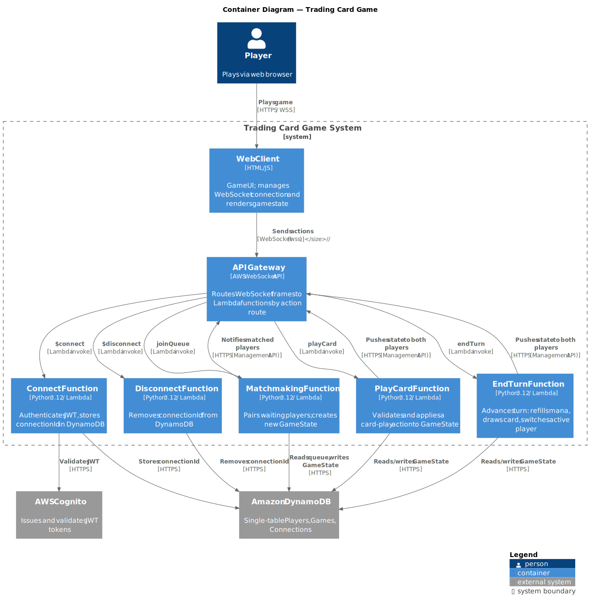
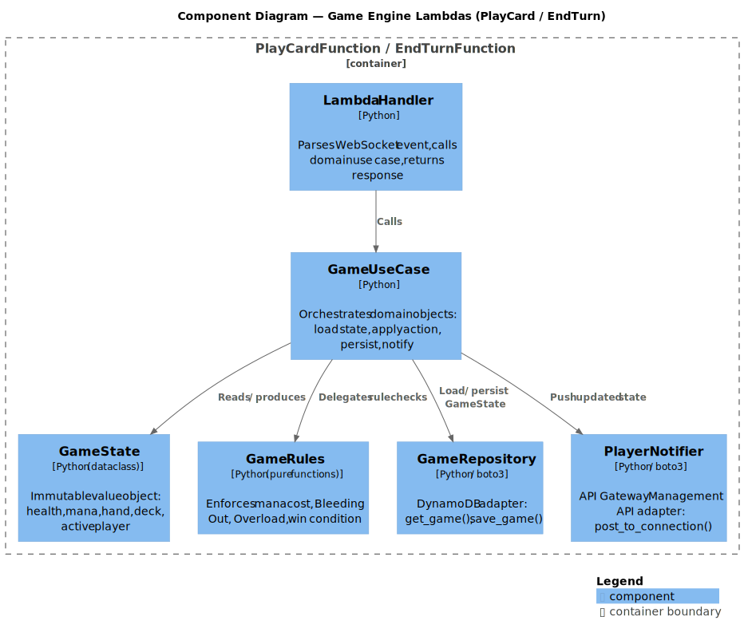

# 5. Building Block View

## 5.1 Level 1 — Containers

| Container | Technology | Responsibility |
|-----------|-----------|---------------|
| Web Client | HTML/JS | Game UI; owns WebSocket lifecycle |
| Game Service | Python 3.12 in Docker | WebSocket server + domain logic + SQLite access |
| SQLite Database | File on Docker volume | Persists players, games, connections |

The Game Service is a single Docker image that hosts the WebSocket endpoint
and all action handlers in one process.

## 5.2 Level 2 — Components (inside the Game Service)

Every action (`connect`, `disconnect`, `join_queue`, `play_card`, `end_turn`)
is dispatched to its own handler function that follows the same shape:

| Component | Type | Responsibility |
|-----------|------|---------------|
| WebSocket Router | Adapter (in) | Parses the incoming frame and dispatches to an action handler |
| Action Handler | Application | Orchestrates: load → apply → persist → notify |
| GameState | Domain (value object) | Immutable snapshot: health, mana, hand, deck, active player |
| Game Rules | Domain (pure functions) | Mana check, Bleeding Out, Overload, win condition |
| GameRepository | Adapter (out) | SQLite `get_game()` / `save_game()` |
| PlayerNotifier | Adapter (out) | Sends a frame over an open WebSocket connection |

## 5.3 SQLite Schema

| Table | Columns | Notes |
|-------|---------|-------|
| `games` | `game_id` (PK), `state_json` | Full game state serialised as JSON |
| `connections` | `connection_id` (PK), `player_id`, `expires_at` | Maps connection → player; rows older than 24 h are pruned |
| `queue` | `player_id` (PK), `joined_at` | Players waiting for a match |
